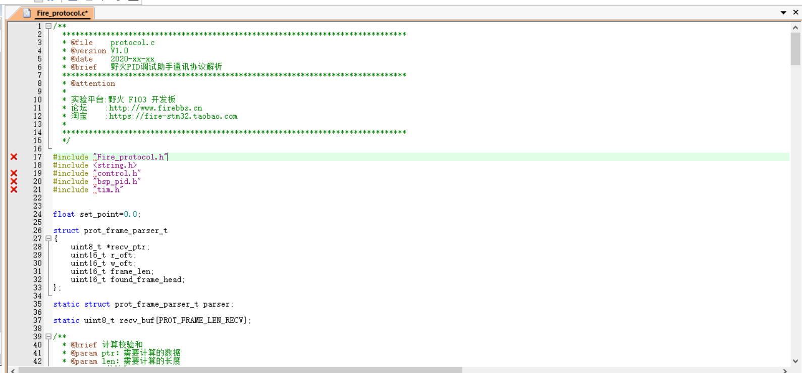
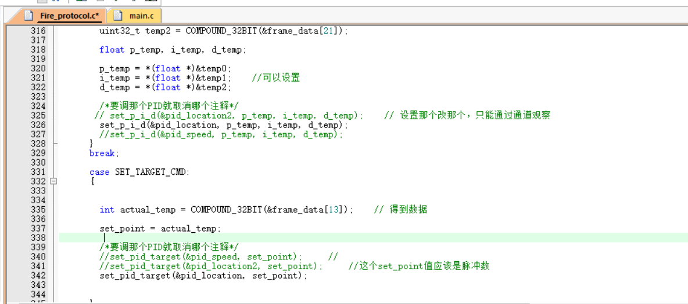
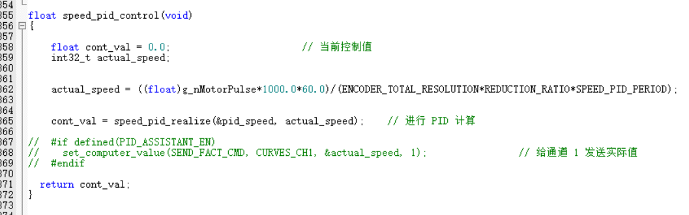

# PID 调试

PID调试我们用的是野火串口调试助手 + 野火的历程

首先将protocol.c和protocol.h给加进来



其次，在main文件和调试PID的文件中调用protocol.c。在是stm32f1xx_it.c中加入一个函数，在stm32f1xx_it.c的头部加上

```c
uint8_t dr;
volatile uint8_t sr_status;
```

```c
void USART1_IRQHandler(void)
{
  /* USER CODE BEGIN USART1_IRQn 0 */
	sr_status = huart1.Instance->SR & (1<<3);  //clear SR register ORE bit status
	dr = huart1.Instance->DR;
  	protocol_data_recv(&dr, 1);
  /* USER CODE END USART1_IRQn 0 */
  	HAL_UART_IRQHandler(&huart1);
  /* USER CODE BEGIN USART1_IRQn 1 */
	
  /* USER CODE END USART1_IRQn 1 */
}
```

调整protocol.c中部分参数，L342，L326



在control.c（就是pid实现函数）中也做一些调整，打开传送方法



main函数里也要将中断打开

```c
__HAL_UART_ENABLE_IT(&huart1,UART_IT_RXNE);    //串口1接收中断 调试PID

protocol_init();

while(1)
{
    receiving_process();
}
```

