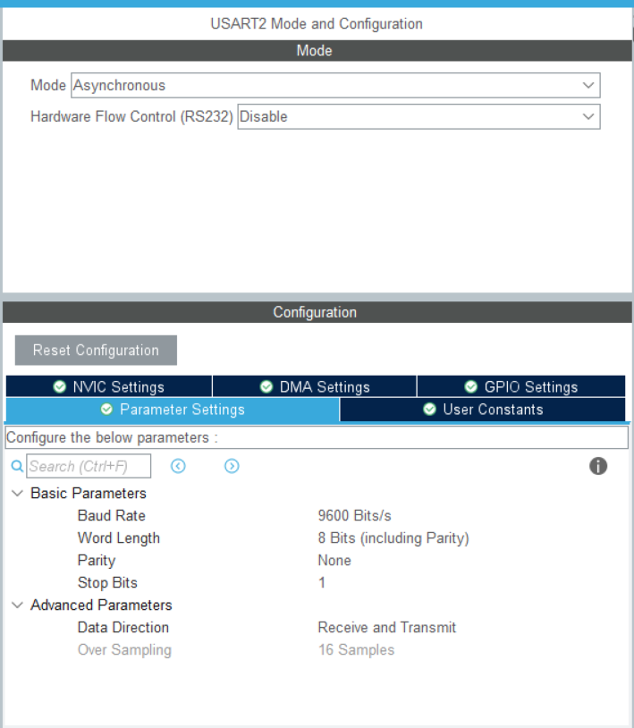
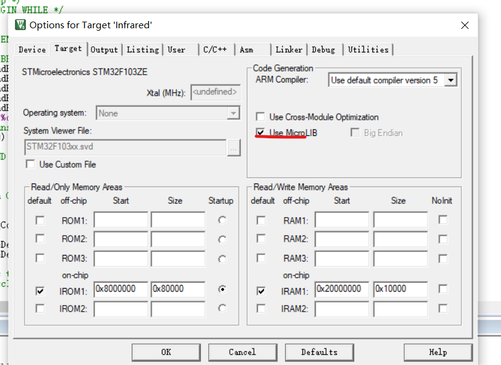

# 串口通讯

## 串口发送问题

如何将数值发送到计算机上

像往常一样在Cubemx中打开usart1，注意我们的蓝牙端口只支持9600波特率

这边选择异步



重写fputc()函数和fgetc()函数，在`stm32f1xx_hal.c`中

```c
#include <stdio.h>
extern UART_HandleTypeDef huart2;

int fputc(int ch, FILE *f)
{
  HAL_UART_Transmit(&huart2, (uint8_t *)&ch, 1, 0xffff);
  return ch;
}
 

int fgetc(FILE *f)
{
  uint8_t ch = 0;
  HAL_UART_Receive(&huart2, &ch, 1, 0xffff);
  return ch;
}

```

在main函数中，只需要轻轻松松的调用个`printf()`即可

当然要注意



这个选项一定要打开

## 串口接收

