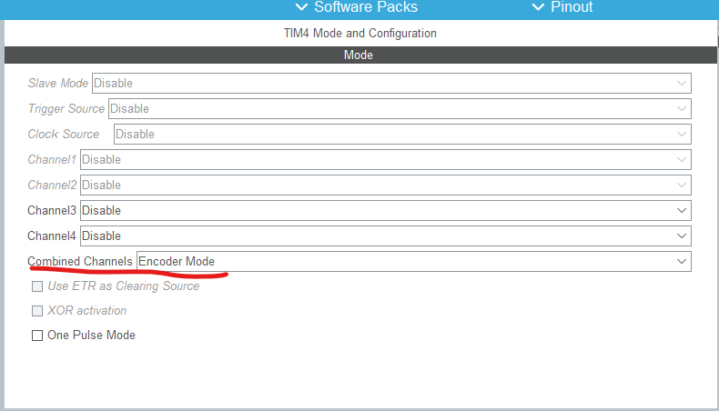
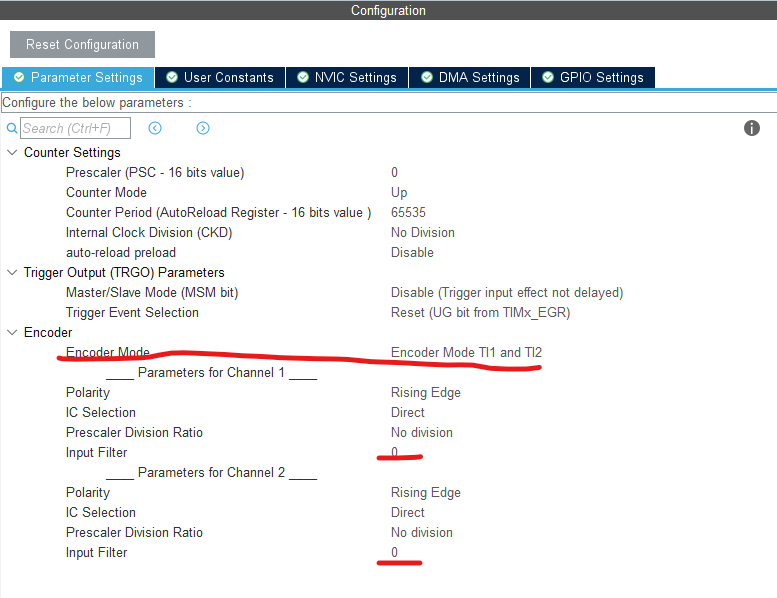
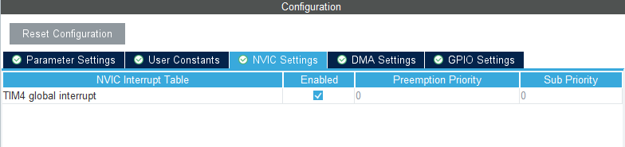
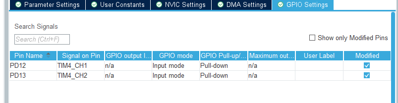
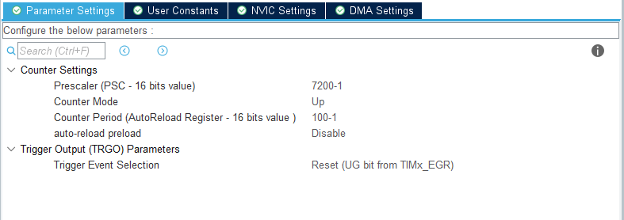
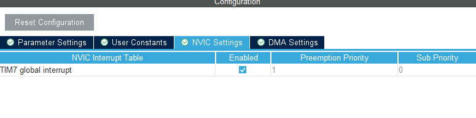
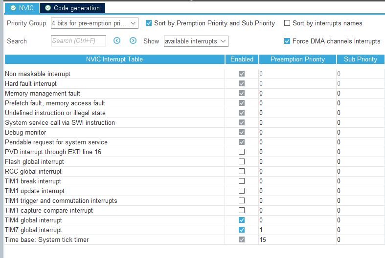

# 编码器配置流程
## 前言
首先，按照所有工程一样，请配置RCC的时钟配置默认72MHZ。

## 第一个定时器

先配置一个定时器，在combined channels选择encoder mode

选择红色标记几项，注意 encoder mode 要选择为T1,T2

把NVIC设置，使能中断

GPIO设置中，下拉

好了编码器就完成了

## 第二个寄存器
第二个寄存器的作用是启动中断，我们这只用TIM7/TIM8，因为这个只有中断功能

这样设置的周期是10ms，然后使能中断

配置完成

## 其它事项
首先将编码器中断的优先级调的高于计时器


再者，代码部分，main函数
```C
 HAL_Init();

  /* USER CODE BEGIN Init */

  /* USER CODE END Init */

  /* Configure the system clock */
  SystemClock_Config();

  /* USER CODE BEGIN SysInit */

  /* USER CODE END SysInit */

  /* Initialize all configured peripherals */
  MX_GPIO_Init();
  MX_TIM4_Init();
  MX_TIM7_Init();
  MX_TIM1_Init();
  /* USER CODE BEGIN 2 */
HAL_TIM_PWM_Start(&htim1, TIM_CHANNEL_1);	    // TIM1_CH1(pwm)
HAL_TIM_PWM_Start(&htim1, TIM_CHANNEL_2);
HAL_TIM_Encoder_Start(&htim4, TIM_CHANNEL_1); // 开启编码器A
HAL_TIM_Encoder_Start(&htim4, TIM_CHANNEL_2); // 开启编码器B	
HAL_TIM_Base_Start_IT(&htim7);                // 使能定时器2中断
	
```
中断回调函数
```C
void HAL_TIM_PeriodElapsedCallback(TIM_HandleTypeDef *htim)
{
    static unsigned char i = 0;
    if (htim == (&htim7))
    {
				GetMotorPulse();
		}
}
```
累积脉冲值
```C
void GetMotorPulse(void)//读取电机脉冲
{
	g_nMotorPulse = (short)(__HAL_TIM_GET_COUNTER(&htim4));//获取计数器值
	g_nMotorPulse = -g_nMotorPulse;   //测试下看看符不符合先
	__HAL_TIM_SET_COUNTER(&htim4,0);//TIM4计数器清零
	
	//为什么只有在两个都取反之后，才能让两个串级PID有用？不然就会让位置环失效
	//暂时不要浪费时间去找原因,直接在内环（速度）的输出值那 数值取反 就好。
	
	//__HAL_TIM_SET_COUNTER(&htim1,0);//TIM2计数器清零
	
	g_lMotorPulseSigma += g_nMotorPulse;//位置外环使用的脉冲累积      //完成一次位置控制之后才清除。
	//g_lMotor2PulseSigma += g_nMotor2Pulse;//位置外环使用的脉冲累积   //记录了之后也要及时清零呀！！！
}

```


参考网页
[(8条消息) 【STM32CubeMX】PWM控制电机转速与编码器读取（超详解）_csdn hal库 pwm控制电机转速与编码器读取_鲁乎乎的博客-CSDN博客](https://blog.csdn.net/weixin_44270218/article/details/114045057)</br>
[(8条消息) 【STM32】HAL库 STM32CubeMX教程八---定时器输入捕获_hal_tim_readcapturedvalue_Z小旋的博客-CSDN博客](https://blog.csdn.net/as480133937/article/details/99407485)